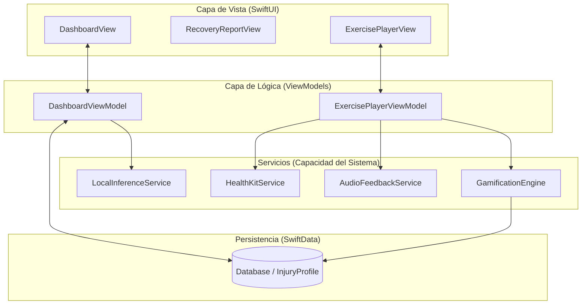
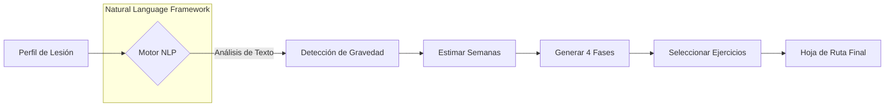
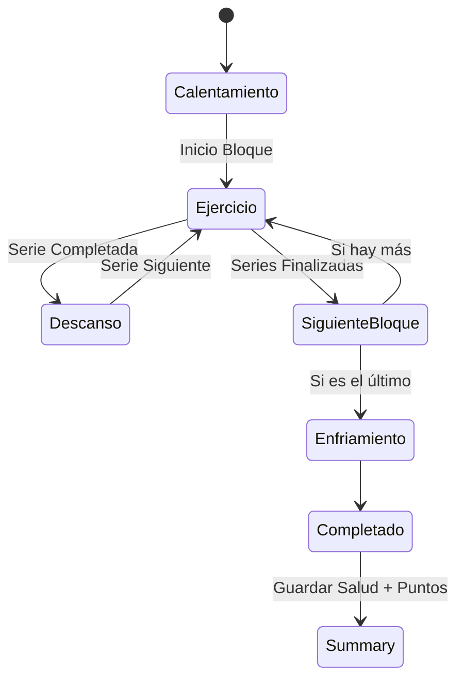
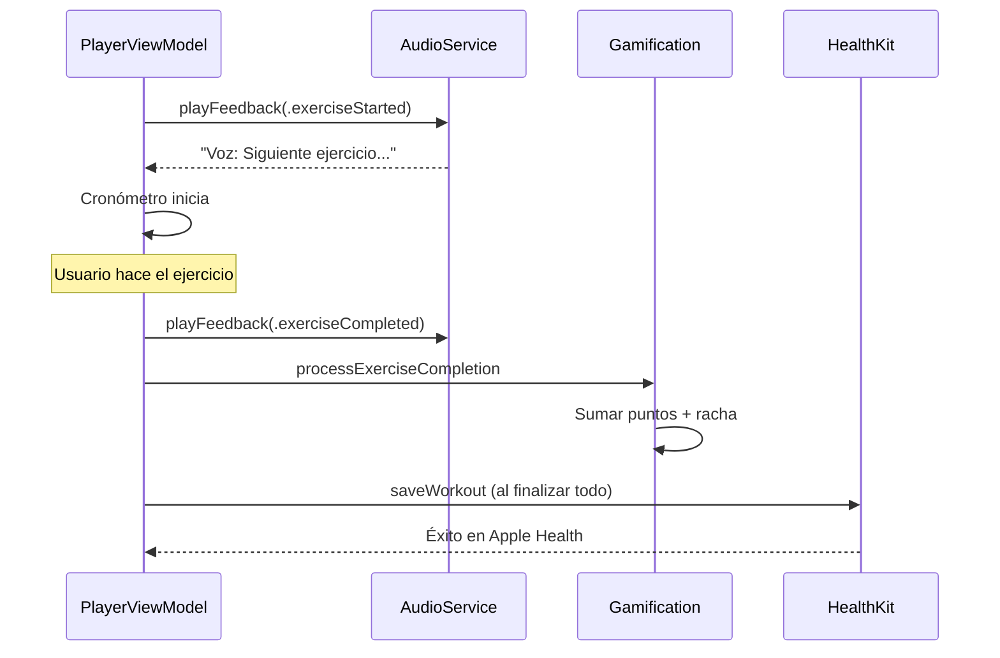

# Diagramas de Arquitectura y Flujo de RehApp

Estos diagramas detallan la arquitectura técnica y los flujos de datos principales de la aplicación para facilitar su comprensión y mantenimiento.

## 1. Arquitectura Técnica (MVVM + SwiftData)
La aplicación utiliza una arquitectura MVVM moderna. El flujo de datos es reactivo y persistente.

---

## 2. Flujo de Generación del Plan (IA Local)
Proceso de inferencia local para transformar datos médicos en un plan de acción.

---

## 3. Estado de la Sesión de Ejercicio
Máquina de estados que gestiona la experiencia del usuario durante el entrenamiento.

---

## 4. Integración de Servicios en el Entrenamiento
Interacción secuencial entre componentes durante la ejecución de ejercicios.

